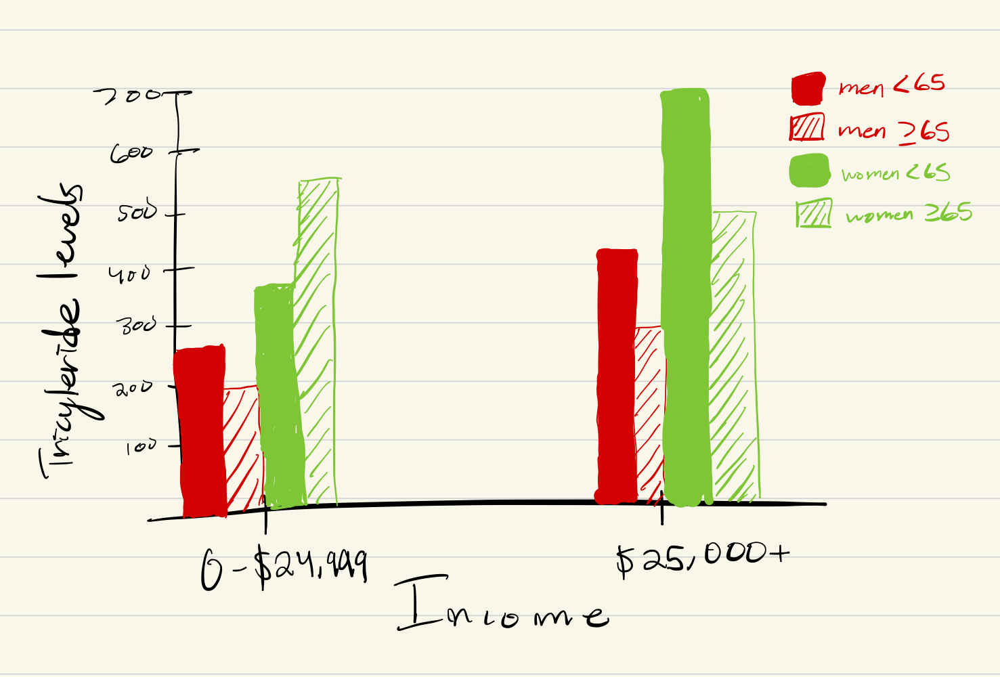

Two questions and charts:

How do triglyceride levels vary with respect to income?
How does age affect triglyceride levels in men and women differently?
  {action, target} pairs could be compare trends and compare is a query action. Also discover distribution which would is an analyze action.
